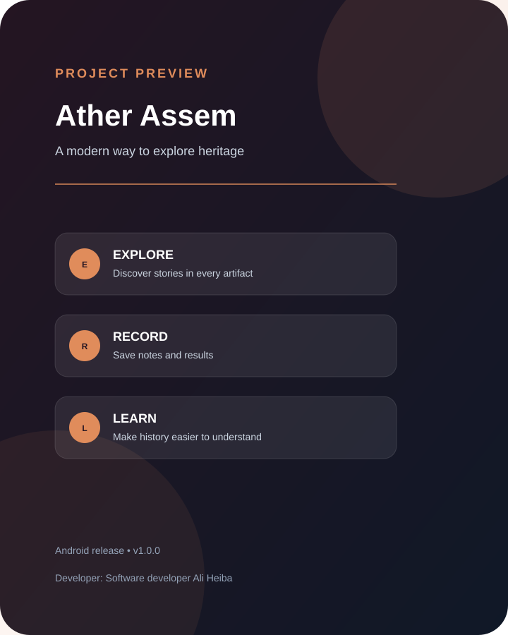

# Ather Assem

**تجربة رقمية عربية لاستكشاف التراث والآثار بطريقة ذكية ومنظمة.**

## عن المشروع

يهدف **Ather Assem** إلى تبسيط فكرة فحص النقوش والقطع الأثرية للمستخدم العادي والمهتم بالتاريخ، من خلال تجربة محمولة تركز على الصورة، التحليل، وحفظ النتائج. يجمع المشروع بين سهولة الاستخدام وروح الاستكشاف، ليجعل توثيق الملاحظات والنتائج أكثر ترتيبًا.

## أبرز جوانب التجربة

- بدء عملية الفحص من خلال صورة يلتقطها المستخدم أو يختارها من الجهاز.
- تنظيم النتائج والعمليات السابقة في سجل يمكن الرجوع إليه.
- تقديم المعلومات بطريقة مبسطة بدلًا من عرضها بشكل تقني معقد.
- دعم الاستخدام التعليمي والاستكشافي والتوثيق الشخصي.
- واجهة مهيأة لتكون عملية وسهلة على الهاتف.

> التطبيق مخصص للمساعدة في الاستكشاف الأولي والتوثيق. لا ينبغي اعتبار النتائج تقريرًا أثريًا نهائيًا أو بديلًا عن مراجعة الخبراء والمصادر العلمية.

## الإصدار المتاح

هذا المستودع العام مخصص للتعريف بالمشروع وتوفير نسخة Android الجاهزة فقط. **الأكواد المصدرية والتفاصيل الداخلية محفوظة في مستودع خاص.**

- الإصدار: `1.0.0`
- المنصة: Android
- [تحميل APK](../../Ather-Assem-Public/releases/tag/v1.0.0)

## Screenshots

### Project overview

### Experience preview

> هذه الصور معاينات مرئية تعريفية للنسخة العامة، بينما يظل الكود المصدري محفوظًا في مستودع خاص.

## المطور

**Software developer Ali Heiba**

## تنبيه الاستخدام

احترم حقوق الملكية والخصوصية عند تصوير المواد أو المواقع الأثرية، وتأكد من الحصول على التصاريح اللازمة. لا تعتمد على أي نتيجة دون التحقق منها عبر مصادر موثوقة أو مختصين.
